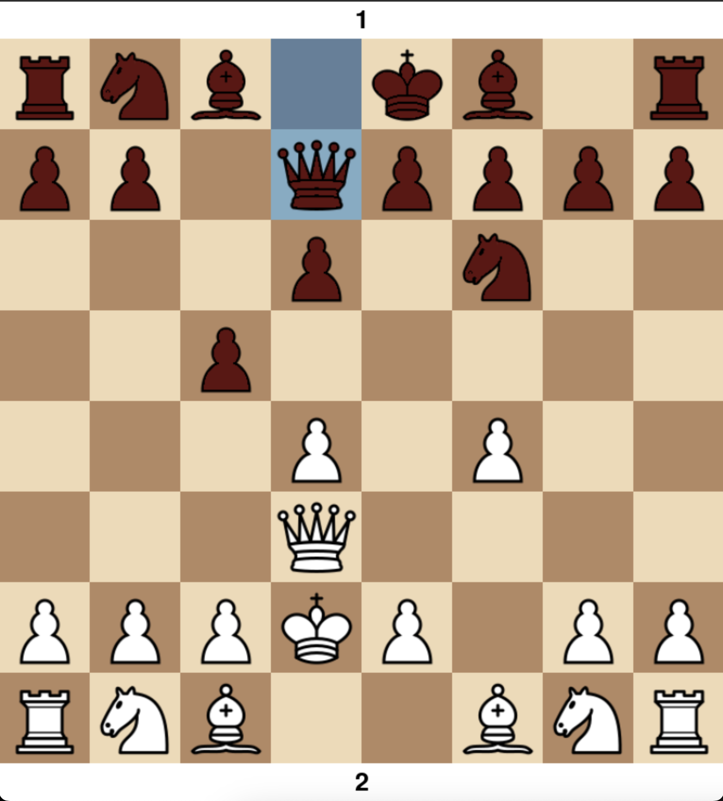
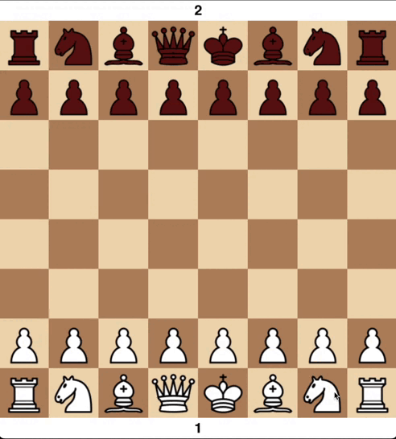
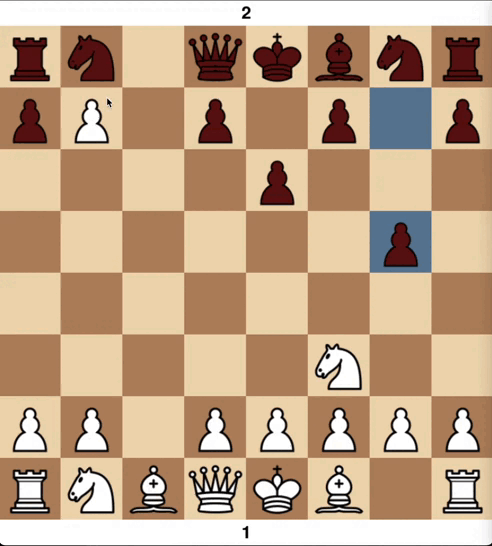
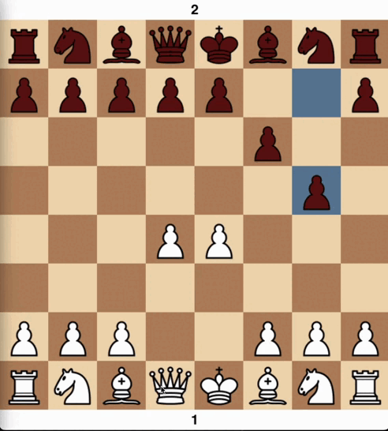

# precious_source_ASVKpython
Precious source for Coop Python Development

# Драфт проектного задания

## Постановка решаемой задачи: один абзац или список фич
- Шахматный сервер и клиент
- Сервер поддерживает несколько лобби
- Возможность подключаться в лобби

## Описание инструментов решения: какие сторонние модули будут использоваться, в рамках каких сервисов (если предполагаются)
- сокеты и асинхронность для сетевого взаимодействия
- модуль pygame для графики
- модуль chess для обработки шахматной логики

## Шахматный клиент с графическим интерфейсом

### Описание
Клиент для сетевой шахматной игры с графическим интерфейсом на `pygame`. Позволяет:
- Подключаться к серверу и играть за белых или чёрных  
- Смотреть чужие партии в режиме зрителя  
- Перетаскивать фигуры мышью (drag-and-drop)  
- Видеть анимации ходов и рокировок  
- Выбирать фигуру при превращении пешки  
- Видеть сообщение об окончании партии (мат/пат)

### Постановка задачи
1. Доска 8×8 (96×96 px клетка) + отступы сверху/снизу по 40 px  
2. Автоматический поворот доски для чёрных  
3. Подсветка ходов и взятий  
4. Меню выбора при превращении пешки  
5. Сообщение «Мат. Белые/Чёрные победили» или «Пат. Ничья»  
6. Плавные анимации всех ходов, включая рокировку  
7. Периодический опрос сервера (каждые 0.3 с) и анимация ходов соперника  

### Макет окна
- Заголовок: `Table <ID>`  
- Светлые/тёмные клетки стандартных цветов  
- Слои подсветки:  
  - Последний ход (синий)  
  - Возможные ходы (жёлтый)  
  - Взятия (красный)  
  - Под шахом (тёмно-красный)  
- Подписи:  
  - Сверху – имя оппонента  
  - Снизу – ваше имя  

### Drag-and-Drop
- ЛКМ по фигуре – начало перетаскивания  
- Перемещение – следование курсору  
- Отпускание ЛКМ – попытка хода (валидный/невалидный)  

### Меню превращения пешки
При достижении последней горизонтали выпадает меню с фигурой:
  ферзь, ладья, слон, конь

### Окончание партии
- Мат – затемнение + «Мат. Белые/Чёрные победили»  
- Пат – затемнение + «Пат. Ничья»

## Text — команды, диагностика, режимы работы
- выбор лобби
- подключение к лобии 
- создание лобби
- выход
